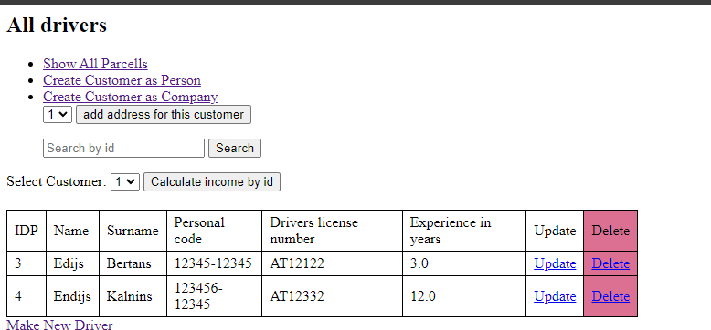
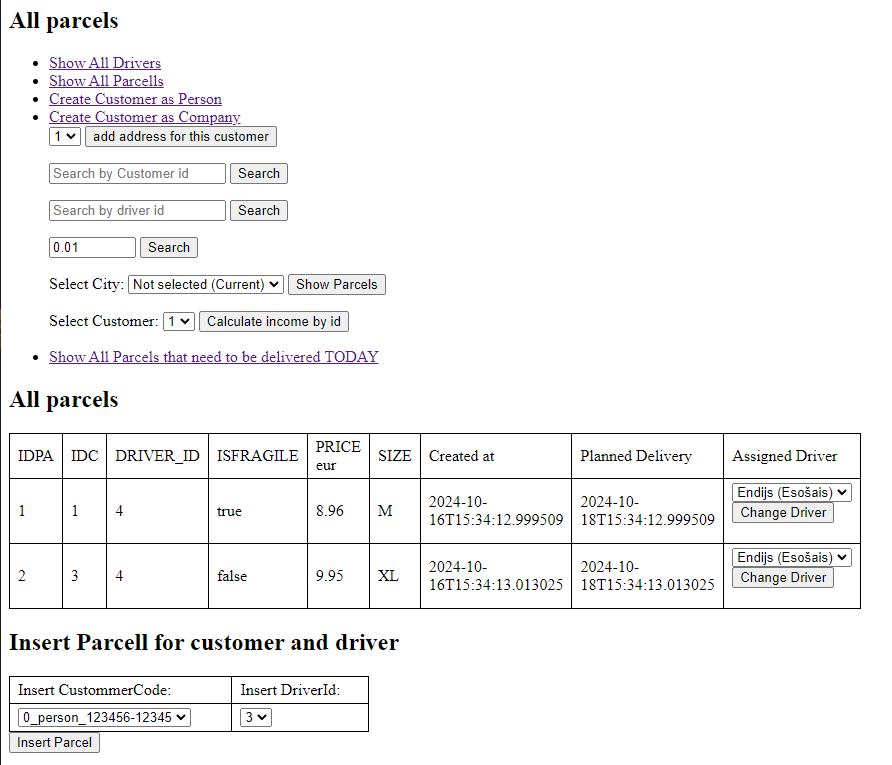

SpringBoot + H2 + JPA + Thymyleaf

The main idea of the information system is to store different types of customers or users—either companies or individual buyers. Each customer can register their address and request packages to be sent to that address. Each package is associated with a courier, who will deliver the package to the address linked to the customer.

DataBase Structure:

Controllers:

Controllers to interact with drivers:

- Get - /driver/show/all
- Get - /driver/show/all/{id}
- Get - /driver/remove/{id}
- Get un Post- /driver/add
- Get un Post - /driver/update/{id}

Controllers to interact with parcels:

- Get - /parcel/show/customer/{id}
- Get - /parcel/show/driver/{id}
- Get - /parcel/show/price/{threshold}
- Get - /parcel/show/city/{cityparam}
- Get un Post - /parcel/add/{customercode}/{driverid}
- Get - /parcel/change/{parcelid}/{driverid}
- Get - /parcel/calculate/income/{customerid}
- Get - /parcel/calculate/count/today

Controllers to interact with customers:
- Get un Post - /customer/create/person 
- Get un Post - /customer/create/company 
- Get un Post - /customer/add/address/{customerid}

Now some examples of the system:

