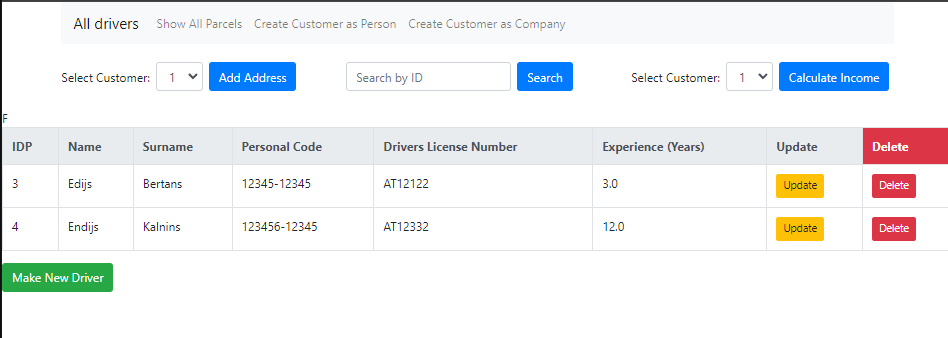

# Eomniva




# Technologies used:
- SpringBoot
- H2
- JPA 
- Thymyleaf

The main idea of the information system is to store different types of customers or users—either companies or individual buyers. Each customer can register their address and request packages to be sent to that address. Each package is associated with a courier, who will deliver the package to the address linked to the customer.

# DataBase Structure:

# Controllers

Controllers to interact with drivers:
```
- Get - /driver/show/all
- Get - /driver/show/all/{id}
- Get - /driver/remove/{id}
- Get, Post- /driver/add
- Get, Post - /driver/update/{id}
```
Controllers to interact with parcels:
```
- Get - /parcel/show/customer/{id}
- Get - /parcel/show/driver/{id}
- Get - /parcel/show/price/{threshold}
- Get - /parcel/show/city/{cityparam}
- Get, Post - /parcel/add/{customercode}/{driverid}
- Get - /parcel/change/{parcelid}/{driverid}
- Get - /parcel/calculate/income/{customerid}
- Get - /parcel/calculate/count/today
```
Controllers to interact with customers:
```
- Get, Post - /customer/create/person 
- Get, Post - /customer/create/company 
- Get, Post - /customer/add/address/{customerid}
```